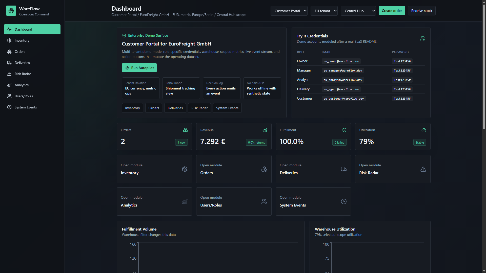
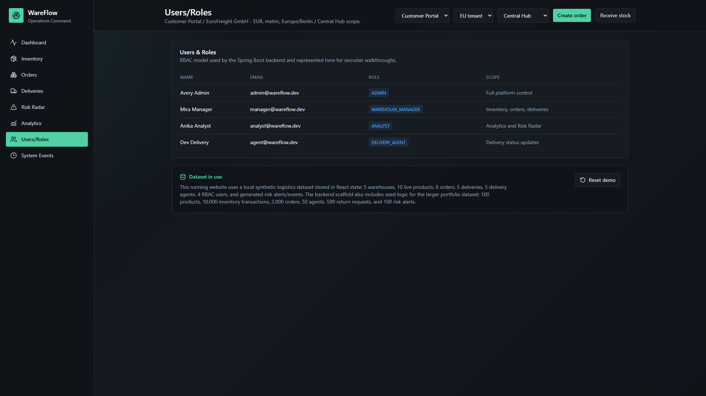
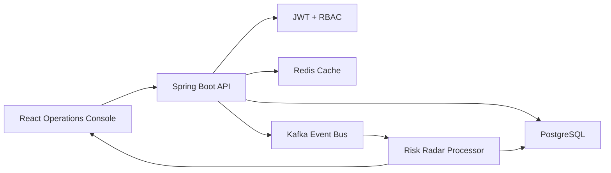
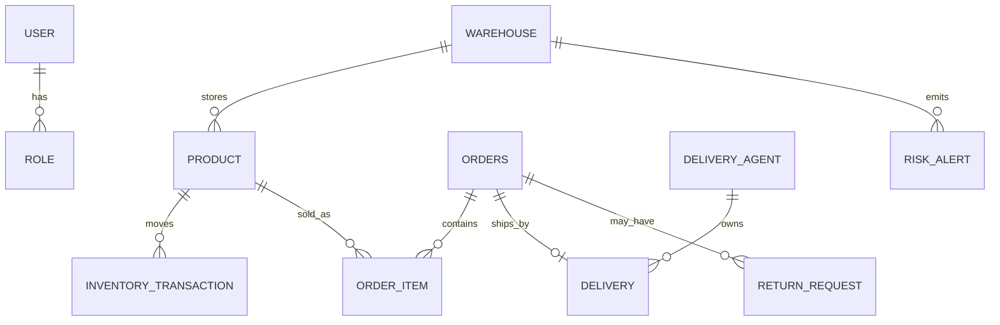

# WareFlow - Smart Warehouse & Logistics Management Platform

Recruiter-grade full-stack logistics command center for inventory, orders, delivery operations, analytics, and proactive operational risk detection.

## Problem Statement

Fast-moving e-commerce warehouses lose money when stockouts, failed fulfillment, late deliveries, returns, and capacity pressure are discovered too late. WareFlow models an internal logistics platform that helps operations teams see what is happening now and what is likely to break next.

## Why This Is Not A Basic CRUD App

- Event-driven architecture using Kafka-style domain events.
- JWT security with role-aware authorization for admins, managers, delivery agents, and analysts.
- Redis-backed caching design for inventory and dashboard metrics.
- Rule-based Operational Risk Radar that explains severity, cause, and recommended action.
- Realistic seed-data strategy for warehouses, products, orders, returns, agents, transactions, and risk alerts.
- Clean backend layering: controller, service, repository, DTO, entity, config, security, exception handling.
- Premium dashboard UX with KPIs, charts, filters, badges, skeleton loading states, event timeline, and responsive layouts.

## Key Features

| Area | Capabilities |
| --- | --- |
| Authentication | JWT login, roles, protected endpoints, seeded demo users |
| Warehouse | Products, stock movement, inbound/outbound tracking, damaged items, batch/expiry, capacity |
| Orders | Create, cancel, return, status tracking, inventory deduction, failed fulfillment reason |
| Delivery | Agent assignment, status updates, ETA, delay flags, performance tracking |
| Analytics | Orders, revenue, sold products, low stock, return rate, utilization, agent performance |
| Risk Radar | Predictive operational alerts with score, severity, reason, and action |
| System Events | ORDER_CREATED, INVENTORY_UPDATED, DELIVERY_ASSIGNED, ORDER_CANCELLED, ORDER_RETURNED, LOW_STOCK_TRIGGERED, RISK_DETECTED |

## Screenshots

### Interactive Operations Dashboard



### Users & Roles



## Tech Stack

| Layer | Technology |
| --- | --- |
| Frontend | React, TypeScript, Tailwind CSS, Recharts, Axios, Vite |
| Backend | Java 17, Spring Boot, Spring Security, JWT, Spring Data JPA |
| Data | PostgreSQL, Redis |
| Messaging | Kafka |
| Quality | JUnit, Mockito, Spring Boot Test |
| DevOps | Docker, Docker Compose, GitHub Actions |

## Architecture



## ER Diagram



## Local Setup

```bash
cd wareflow-smart-logistics-platform
docker compose up -d postgres redis kafka
cd backend
./mvnw spring-boot:run
cd ../frontend
npm install
npm run dev
```

For a quick backend + Swagger demo without Docker/PostgreSQL, run:

```powershell
cd backend
.\start-local.ps1
```

Then open:

- Swagger UI: http://localhost:8080/swagger-ui.html
- OpenAPI JSON: http://localhost:8080/v3/api-docs

The local profile uses an in-memory H2 database and Spring's simple cache so the backend can boot on a clean Windows machine.

Demo credentials:

| Role | Email | Password |
| --- | --- | --- |
| ADMIN | admin@wareflow.dev | password |
| WAREHOUSE_MANAGER | manager@wareflow.dev | password |
| ANALYST | analyst@wareflow.dev | password |
| DELIVERY_AGENT | agent@wareflow.dev | password |

## Docker Setup

```bash
docker compose up --build
```

Services:

- Frontend: http://localhost:5173
- Backend API: http://localhost:8080
- Swagger UI: http://localhost:8080/swagger-ui.html
- PostgreSQL: localhost:5432
- Redis: localhost:6379
- Kafka: localhost:9092

## Testing

```bash
cd backend
./mvnw test
cd ../frontend
npm test
npm run build
```

## Performance Targets

| Metric | Target |
| --- | --- |
| Dashboard cached response | p95 under 120ms |
| Inventory search | p95 under 180ms with SKU and warehouse indexes |
| Risk radar refresh | Under 3s for 100 active alerts |
| Frontend first load | Under 2.5s on fast 4G after build |

## Deployment Guide

See [docs/DEPLOYMENT_GUIDE.md](docs/DEPLOYMENT_GUIDE.md). The repository is structured so the backend container can run on ECS/Fargate, the frontend can be served through S3/CloudFront or a container, and managed PostgreSQL, Redis, and Kafka can replace local compose services.

## Future Improvements

- Replace rule-only risk detection with a supervised model trained on fulfillment outcomes.
- Add route optimization with maps.
- Add webhook integrations for carrier updates.
- Add audit logs and immutable event storage.
- Add tenant isolation for multi-company SaaS mode.

## Author

Built as a flagship fresher SDE portfolio project to demonstrate system design, backend engineering, frontend product sense, testing, DevOps, and operational thinking.
