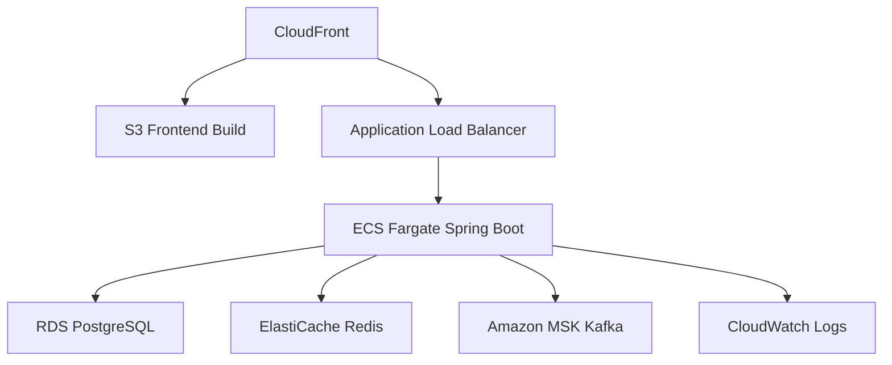

# AWS Deployment Shape

```mermaid
flowchart TB
  CF["CloudFront"] --> S3["S3 Frontend Build"]
  CF --> ALB["Application Load Balancer"]
  ALB --> ECS["ECS Fargate Spring Boot"]
  ECS --> RDS["RDS PostgreSQL"]
  ECS --> EC["ElastiCache Redis"]
  ECS --> MSK["Amazon MSK Kafka"]
  ECS --> CW["CloudWatch Logs"]
```
