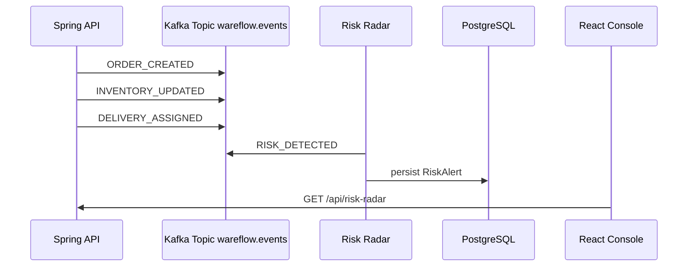

# Kafka Event Flow

```mermaid
sequenceDiagram
  participant API as Spring API
  participant Kafka as Kafka Topic wareflow.events
  participant Risk as Risk Radar
  participant DB as PostgreSQL
  participant UI as React Console
  API->>Kafka: ORDER_CREATED
  API->>Kafka: INVENTORY_UPDATED
  API->>Kafka: DELIVERY_ASSIGNED
  Risk->>Kafka: RISK_DETECTED
  Risk->>DB: persist RiskAlert
  UI->>API: GET /api/risk-radar
```
